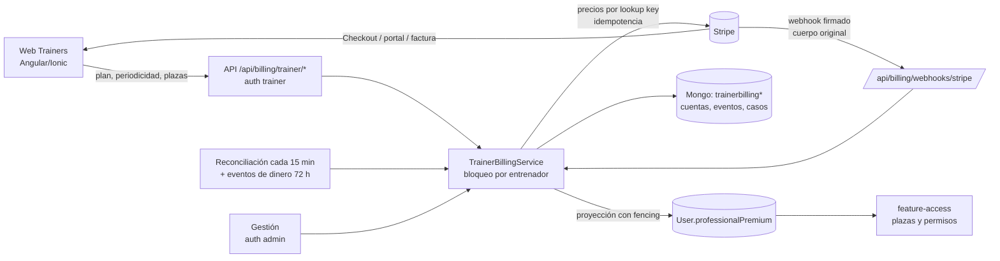

# Auditoría de la facturación de Trainers con Stripe — 09/10/2026

Alcance: la suscripción que los entrenadores pagan a TrainFit (`components/trainerBilling`, `components/billing/billing-routes.js`, `scripts/trainer-billing-preflight.js` y la página `apps/train-fit-trainers/src/app/features/subscription` del front). No cubre los cobros de clientes a entrenadores (`trainerPayments`).

Método: lectura completa del código; tests automáticos; pruebas en el sandbox «Entorno de prueba de TrainFit» con el conector de Stripe, siempre sobre objetos desechables o de solo lectura; y diagnóstico del entorno PRE real (Render + Cloudflare) a partir de lo que mostraban la web, la red y Stripe.

En cada punto se indica cómo está comprobado:
- **[test]**: hay un test automático que falla sin el arreglo y pasa con él.
- **[sandbox]**: comprobado contra Stripe en el sandbox.
- **[PRE]**: observado en el entorno de pruebas desplegado.
- **[código]**: solo inspección del código.
- **[pendiente]**: requiere acceso que no hubo (Dashboard, logs de Render, cuenta live).

## A. Resumen ejecutivo

La integración está bien diseñada en lo esencial:
- precios de confianza en el servidor;
- acceso solo con factura pagada;
- webhooks firmados con el cuerpo original;
- idempotencia en todas las mutaciones;
- separación sandbox/real;
- política de reembolsos y disputas con decisión humana.

Esta auditoría encontró una **familia de defectos críticos que el entorno PRE sacó a la luz el 09/10**. Cuando Stripe *rechaza* una operación (petición inválida o clave sin permiso), el backend la dejaba guardada como pendiente y la reintentaba en cada relectura de la cuenta. Las consecuencias:
- `sync`, las propuestas de cambio, los webhooks, la reconciliación e incluso las intervenciones de Gestión respondían 503 para esa cuenta;
- a las 23 h, la cuenta quedaba en «revisión de soporte» para siempre, sin herramienta para desbloquearla.

Pasó con Checkout y con el cambio de plan, y afectaba igual a cancelar, reactivar, descartar, programar bajadas y crear el cliente.

**Todos esos defectos están corregidos y cubiertos por tests.** Los criterios son:
- un rechazo se descarta y se avisa;
- un error de red se reintenta con la misma clave;
- pasadas 23 h manda el estado real de Stripe;
- nada bloquea la relectura de una cuenta.

**Valoración de preparación para producción**

| Bloque | Estado | Motivo |
|---|---|---|
| Código | **Listo tras esta ronda** | 196 tests de pagos en el backend y 53 en el front. Hasta ahora, la única suscripción real del sandbox con Managed Payments solo ha podido contratar; el cambio de plan está pendiente de confirmar en PRE (STRIPE-010). |
| Operación | **No lista** | Bloqueos fuera del código: alta fiscal y condiciones publicadas (guía, C1), causa exacta del rechazo de la subida en PRE (STRIPE-010), verificación de renovaciones e impagos con reloj de pruebas y preflight en verde en cada entorno. |

## B. Arquitectura

Fuente de verdad: **Stripe** para la suscripción, las facturas y los pagos. Mongo guarda una proyección releída de Stripe (`refresh`) dentro de un bloqueo por entrenador. El acceso efectivo (`effectiveAccess`) es lo pagado, menos los periodos retirados, más las excepciones. El navegador nunca envía importes ni IDs de precio.

## C. Inventario

| Ruta | Responsabilidad | Estado |
|---|---|---|
| `components/trainerBilling/src/service.ts` | Contratar, sincronizar, cambios, cancelación, eventos, dinero, reconciliación, borrado, Gestión | Corregido en esta auditoría |
| `components/trainerBilling/src/stripe-gateway.ts` | Única capa que habla con Stripe; traduce rechazos | Corregido |
| `components/trainerBilling/src/config.ts` / `catalog.ts` | 5 variables, validación, catálogo y lookup keys | Correcto; aviso de arranque añadido |
| `components/trainerBilling/src/mongo-repository.ts` | Cuentas, eventos, casos, intervenciones; bloqueo con lease | Correcto [código] |
| `components/trainerBilling/src/runtime.ts` / `adapter.js` | Arranque, reconciliación, metadatos para la web, errores HTTP | Log de errores con causa |
| `components/billing/billing-routes.js`, `app.js` | Rutas con `auth(["trainer"])`/`auth(["admin"])`; webhook antes de `express.json` | Correcto [test] |
| `scripts/trainer-billing-preflight.js` | Comprobación previa sin secretos | Permisos de escritura y aviso de condiciones añadidos |
| `scripts/stripe-sync-catalog.js` | Crea productos y precios | Correcto; precios presentes en el sandbox [sandbox] |
| Front `features/subscription/*` | Configurador, Checkout, retorno, propuesta, portal, facturas | Corregido (botón, motivos, mensajes) |

## D. Hallazgos

| ID | Severidad | Estado | Título |
|---|---|---|---|
| STRIPE-001 | Crítica | Corregido y en `develop` | Checkout rechazado dejaba la cuenta en `CHECKOUT_REVIEW_REQUIRED` para siempre |
| STRIPE-002 | Crítica | Corregido (rama) | Cambio de plan rechazado bloqueaba toda la cuenta (503 en sync, propuestas, webhooks, Gestión) |
| STRIPE-003 | Alta | Corregido (rama) | Cancelar, reactivar o descartar rechazados: mismo bloqueo |
| STRIPE-004 | Alta | Corregido (rama) | Operaciones sin confirmar más de 23 h congelaban la cuenta |
| STRIPE-005 | Alta | Corregido (rama) | Creación del cliente rechazada: revisión de soporte a las 23 h |
| STRIPE-006 | Alta | Corregido (rama) | Disputa sin poder pausar cobros: el caso no se registraba |
| STRIPE-007 | Media | Corregido (rama) | Fallos silenciosos: log genérico y reconciliación muda |
| STRIPE-008 | Media | Corregido y en `develop` | Facturación apagada sin rastro en el log |
| STRIPE-009 | Media | Resuelto por configuración; preflight avisa | Condiciones sin URL en los datos públicos rompían Checkout |
| STRIPE-010 | Alta | Pendiente de verificación | Causa del rechazo de la subida Free→Inicio en PRE |
| STRIPE-011 | Media | Corregido y en `develop` | La web no mostraba el botón de contratar ni el motivo |
| STRIPE-012 | Baja | Corregido (rama) | Mensajes genéricos ante rechazos del sistema de pagos |
| STRIPE-013 | Informativa | Pendiente de decisión | Dominio de la web de PRE inconsistente en la documentación |
| STRIPE-014 | Informativa | Pendiente | Página de condiciones inexistente en la URL configurada |
| STRIPE-015 | Informativa | Pendiente | Renovaciones e impagos no verificados de punta a punta |

### STRIPE-001 — Checkout rechazado dejaba la cuenta bloqueada para siempre
- **Dónde:** `service.ts#checkout` (intento guardado antes de llamar a Stripe; bloqueo a los 25 min).
- **Evidencia [PRE][sandbox]:** el cliente del entrenador en el sandbox se creó y no tenía ninguna sesión de Checkout; la web recibía `CHECKOUT_REVIEW_REQUIRED`. Reproducido en el sandbox: con `consent_collection` y sin URL de condiciones en los datos públicos, Stripe responde *"You cannot collect consent to your terms of service unless a URL is set in the Stripe Dashboard"*; sin ella, la sesión se crea.
- **Impacto:** el entrenador no podía contratar nunca más; no hay herramienta en Gestión para desbloquearlo.
- **Corrección:** el rechazo de Stripe se traduce a `CHECKOUT_REJECTED`, el intento se descarta y se restaura el estado anterior. Un intento sin ninguna sesión suya en Stripe pasados 25 min se sustituye: la lista de sesiones del customer es completa, así que no hay riesgo de doble cobro.
- **Prueba [test]:** `service.test.js` «si Stripe rechaza abrir Checkout…» y «un intento que Stripe nunca llegó a crear…»; `stripe-gateway.test.js`, rechazo con log sin mensaje.

### STRIPE-002 — Cambio de plan rechazado bloqueaba toda la cuenta
- **Dónde:** `service.ts#changePlan` y `#recoverChange` (el cambio se guarda `processing` antes de `subscriptions.update`).
- **Evidencia [PRE]:**
  - `sync`, `change-preview` y `change-plan` devolvían 503 `BILLING_UNAVAILABLE`;
  - en Stripe la suscripción seguía intacta, sin factura nueva ni `pending_update`;
  - el evento `customer.subscription.created` tenía `pending_webhooks: 1`, es decir, el webhook fallaba;
  - la web ocultaba todas las acciones.
- **Impacto:** cuenta inoperable (también para webhooks, reconciliación y Gestión); a las 23 h, revisión de soporte permanente.
- **Corrección:** los rechazos (`StripeInvalidRequestError`, `StripePermissionError`; nunca `StripeIdempotencyError`) se traducen a `CHANGE_REJECTED`. El cambio se descarta, se conserva lo pagado y `changePlan` devuelve error en vez de «aplicado». Un error de red sigue reintentándose con la misma clave.
- **Prueba [test]:** `service.test.js` «si Stripe rechaza aplicar una subida…», «un error de red al aplicar una subida no descarta el cambio…»; `stripe-gateway.test.js` (permiso e idempotencia).

### STRIPE-003 — Cancelar, reactivar o descartar rechazados bloqueaban la cuenta
- **Dónde:** `service.ts#recoverControl` y `#controlLocked`; `stripe-gateway.ts#setCancellation`, `#voidInvoice`, `#releaseSchedule`.
- **Evidencia [código][test]:** el mismo patrón que STRIPE-002.
- **Corrección:** `CONTROL_REJECTED`; la operación se cierra como rechazada, se avisa al usuario y la suscripción no cambia.
- **Prueba [test]:** `recovery.test.js` «cancelar la renovación que Stripe rechaza…».

### STRIPE-004 — Operaciones sin confirmar más de 23 h congelaban la cuenta
- **Dónde:** `recoverChange` y `recoverControl` lanzaban `CHANGE_REVIEW_REQUIRED` al principio de `refresh`, antes de leer Stripe.
- **Impacto:** tras un día de fallos de red, la cuenta dejaba de ver renovaciones, impagos y cancelaciones, el acceso caducaba localmente aunque el cliente pagara, y Gestión no podía intervenir.
- **Corrección:** pasadas 23 h (la clave de idempotencia de Stripe dura 24 h) no se reintenta y manda el estado de Stripe:
  - subida con `pending_update` → pago pendiente con su factura;
  - plan igual al destino → aplicado;
  - en otro caso → descartado.
  Las operaciones de control se cierran y la cancelación real se lee de la suscripción.
- **Prueba [test]:** `recovery.test.js` (respuesta perdida, error de red y cancelación, con 24 h simuladas).

### STRIPE-005 — Creación del cliente rechazada
- **Corrección:** `CUSTOMER_REJECTED`; se borra `customerStartedAt` y el siguiente intento empieza limpio.
- **Prueba [test]:** `recovery.test.js`.

### STRIPE-006 — Disputa sin poder pausar cobros: caso invisible
- **Dónde:** `service.ts#handleDispute` (la pausa iba antes de registrar el caso).
- **Corrección:** el caso se registra siempre (prioridad alta, «responder disputa») y el evento falla para reintentar la pausa.
- **Prueba [test]:** `recovery.test.js`.

### STRIPE-007 — Fallos silenciosos
- **Corrección:** `errorTrace` en `types.ts`, que registra la clase del error, su código, el parámetro y el id de la petición de Stripe, nunca el mensaje.
  - El adaptador registra la operación (`sync`, `changePreview`, `webhook`…).
  - La reconciliación resume sus fallos por ronda.
  - Los rechazos dicen qué operación rechazó Stripe.
- **Prueba [test]:** `adapter-errors.test.js`, `recovery.test.js` (reconciliación).

### STRIPE-008 — Facturación apagada sin rastro
- **Corrección:** al arrancar se avisa (`falta STRIPE_KEY` o los códigos de configuración, sin valores). En `develop` (PR #1).
- **Prueba [test]:** `config.test.js`.

### STRIPE-009 — Condiciones sin URL en los datos públicos
- **Estado:** el sandbox ya tiene la URL: la sesión del 09/10 registra `consent.terms_of_service: accepted` [sandbox]. Ahora el preflight avisa de que debe coincidir con `STRIPE_TERMS_URL`, porque la API no permite leerla.

### STRIPE-010 — Causa del rechazo de la subida en PRE (pendiente)
- **Evidencia [sandbox]:**
  - la previsualización del cambio Free+1 plaza → Inicio funciona: 31,42 € hoy;
  - la misma actualización (`pending_if_incomplete`, `always_invoice`, `proration_date`, añadir la cuota y dejar la plaza a 0) **se acepta** en una suscripción desechable sin Managed Payments;
  - una subida con Managed Payments funcionó el 01/10.
- **Candidatos:**
  1. a la clave restringida de PRE le falta *Subscriptions: escritura* (contratar no la necesita);
  2. una restricción de Managed Payments al añadir un producto nuevo.
- **Cómo cerrarlo:** desplegar esta rama y repetir la subida. El log dirá `[TrainerBilling] Stripe rechazó aplicar el cambio: <código> (<parámetro>), petición req_…`. Ejecutar además `npm run billing:preflight`, que ahora comprueba los permisos de escritura sin modificar nada.

### STRIPE-011 / 012 — Web
- Sin suscripción, el configurador mostraba «Es lo que tienes contratado» sin botón.
- Cuando no se podía contratar, enseñaba precios sin explicación.
- Corregido (PR #1): botón visible deshabilitado hasta elegir y motivo junto a los precios.
- Mensajes propios para los rechazos y para `CANCELLATION_SCHEDULED`/`BILLING_UNAVAILABLE` [test].

### STRIPE-013 / 014 / 015 — Pendientes informativos
- **013:** `wrangler.jsonc` y `.github/workflows/README.md` dicen `trainers-pre.trainfit.net`; CORS permite `trainers-dev.trainfit.net`, que es el que usa PRE (las URLs de vuelta de la sesión del 09/10 lo confirman). Hay que unificarlos.
- **014:** `https://trainers-dev.trainfit.net/condiciones-trainers/2026-10/` no existe en el front (la SPA abre la app). Hay que publicar las condiciones reales antes de producción.
- **015:** renovaciones e impagos dependen del tiempo. Stripe solo los adelanta con relojes de prueba en clientes creados dentro del reloj, y el backend crea sus clientes. Los cubren los tests y la verificación de sandbox del 18–28/09, pero falta un recorrido de punta a punta en PRE.

## E. Matriz de casuísticas

| Casuística | Estado | Cómo |
|---|---|---|
| Contratar Free con plazas o un plan de pago | Implementado | [test] + [PRE] sesión pagada el 09/10 (3,63 € con IVA) |
| Doble clic, sesión abierta reutilizada, otro plan con sesión abierta | Implementado | [test] |
| Abandonar Checkout | Implementado | [test] front |
| Stripe rechaza abrir Checkout | Corregido | [test] + [sandbox] |
| Volver con `session_id`: el acceso solo llega con factura pagada | Implementado | [test] |
| Subida inmediata con prorrateo (plan, plazas, mensual→anual) | Implementado | [test] + [sandbox] (forma Free→Inicio aceptada; MP 01/10) |
| Pago de la subida con 3DS o fallido: se conservan las plazas pagadas | Implementado | [test] |
| Respuesta de Stripe perdida: misma clave, sin doble factura | Implementado | [test] |
| Stripe rechaza la subida o la bajada | Corregido | [test] |
| Bajada programada en dos fases, sustitución y descarte | Implementado | [test] + [sandbox 01/10] |
| Reducir por debajo de la cartera: solo lectura, elegir activos | Implementado | [test] |
| Propuesta caducada, importe cambiado o condiciones cambiadas | Implementado | [test] |
| Cancelar a fin de periodo y reactivar | Implementado | [test] + [sandbox 01/10] |
| Stripe rechaza cancelar o reactivar | Corregido | [test] |
| Operación sin confirmar más de 23 h | Corregido | [test] |
| Renovación pagada | Implementado | [test]; de punta a punta [pendiente] |
| Renovación fallida: 7 días de margen y enlace a la factura | Implementado | [test]; de punta a punta [pendiente] |
| Reembolso total, parcial o fallido: caso para decisión humana | Implementado | [test] + [sandbox 28/09] |
| Disputa abierta, perdida o ganada; aviso de fraude | Implementado | [test] + [sandbox 28/09] |
| Disputa sin poder pausar cobros | Corregido | [test] |
| Webhook firmado con cuerpo original, duplicados y desorden | Implementado | [test] |
| Webhook o evento perdido: reconciliación y eventos de dinero de 72 h | Implementado | [test] |
| Portal: facturas, tarjeta, cancelar a fin de periodo; sin cambios de plan | Implementado | [código] + preflight |
| Borrado de la cuenta con suscripción viva | Implementado | [test] |
| Intervenciones de Gestión con motivo y auditoría | Implementado | [test] |
| Sincronización Mongo ↔ Stripe con fencing de la proyección | Implementado | [test] |

## F. Seguridad

Lo comprobado:
- Todas las rutas usan `auth(["trainer"])` o `auth(["admin"])`.
- El navegador no envía ni importe, ni precio, ni customer: `parseTarget` y precios por lookup key validados contra el catálogo (importe, moneda, intervalo, IVA y modo).
- Las sesiones de Checkout y las propuestas se validan contra su propietario (`sessionOwned`, `quoteId` de la cuenta).
- El webhook verifica la firma con el cuerpo original, antes del parser JSON [test].
- Las URLs de Stripe se validan en el front (`safeStripeRedirectUrl`).
- En real solo se admiten claves restringidas.
- Los logs no incluyen mensajes ni payloads.

No se encontraron vulnerabilidades de acceso cruzado ni de elevación a premium.

Riesgo pendiente: los permisos de la clave de cada entorno; el preflight ahora los comprueba.

## G. Pruebas ejecutadas

| Qué | Resultado |
|---|---|
| Back, suites de pagos (`trainerBilling`, `billing`, plazas) | 196/196 |
| Back, `npm run lint` | Sin errores |
| Back, `npm test` completo | No ejecutable aquí: `mongodb-memory-server` no puede descargar MongoDB (proxy 403). Los mismos 531 fallos antes y después de los cambios; ninguno de pagos |
| Front, `npm test` | 608/608 |
| Front, `npm run lint:t` y `ng build --configuration ci` | Sin errores |
| Sandbox (conector) | Checkout con y sin condiciones; previsualización Free→Inicio; actualización Free→Inicio en suscripción desechable; escritura sobre ID inexistente (`No such subscription`, base de la sonda del preflight) |

Objetos de prueba que quedan en el sandbox, sin efecto en nada:
- una sesión de Checkout sin cliente (caduca sola);
- un cliente `scope: audit` con su suscripción cancelada.

## H. Plan

- **P0 (antes de seguir probando en PRE):**
  1. Fusionar esta rama.
  2. Repetir la subida y leer en el log de Render la causa de STRIPE-010.
  3. Ejecutar `npm run billing:preflight` en PRE y dejarlo en ✔.
- **P1:**
  - Recorrido de punta a punta en PRE con la lista de pruebas de la guía.
  - Reloj de pruebas para renovación e impago (STRIPE-015).
  - Unificar el dominio de PRE (STRIPE-013).
- **P2:**
  - Publicar las condiciones (STRIPE-014).
  - Ante una creación de cliente incierta más de 23 h, buscarlo en Stripe por metadatos en lugar de pedir revisión.
- **Producción:** la parte C de `docs/stripe-trainers-guia.md` (alta fiscal, cuenta live, catálogo live, webhook live, prueba real controlada).

## I. Checklist de puesta en producción

- [x] Código: rechazos y operaciones inciertas nunca bloquean una cuenta (tests).
- [x] Código: logs útiles y sin datos sensibles.
- [ ] Preflight en ✔ en PRE y en real, incluidos los **permisos de escritura** (necesita el servidor).
- [ ] Catálogo live creado (`npm run stripe:catalog` con la clave de catálogo).
- [ ] Webhook live con los 31 eventos y la versión `2026-08-26.dahlia`; secreto en el entorno.
- [ ] Datos públicos: condiciones, privacidad y buzón; la URL de condiciones igual a `STRIPE_TERMS_URL`.
- [ ] Condiciones publicadas en su URL.
- [ ] Portal predeterminado con facturas, tarjeta y cancelación a fin de periodo; sin cambios de plan.
- [ ] Managed Payments «Listo para usar» en live.
- [ ] Alta fiscal y validación de la asesoría (guía, C1).
- [ ] Renovación e impago verificados con reloj de pruebas.
- [ ] Prueba real controlada (guía, C7) y monitorización de las primeras semanas (C8).

## J. Conclusión

- **Bien implementado:** el modelo de seguridad, la idempotencia, el acceso solo con factura pagada, la política de dinero y los webhooks.
- **Errores reales encontrados y corregidos:** una familia de bloqueos permanentes de cuenta ante rechazos u operaciones inciertas de Stripe (STRIPE-001 a 007) y la experiencia de la web cuando no se puede contratar.
- **Sin verificar todavía:** la causa exacta del rechazo de la subida en PRE (permisos o Managed Payments), las renovaciones e impagos de punta a punta y todo lo de la cuenta live.
- **Qué impide lanzar hoy:** la configuración de producción y la parte fiscal, no el código.
- **Orden recomendado:** fusionar → leer la causa en el log y ajustar la clave → preflight → recorrido completo en PRE → reloj de pruebas → configuración live → prueba real controlada.
